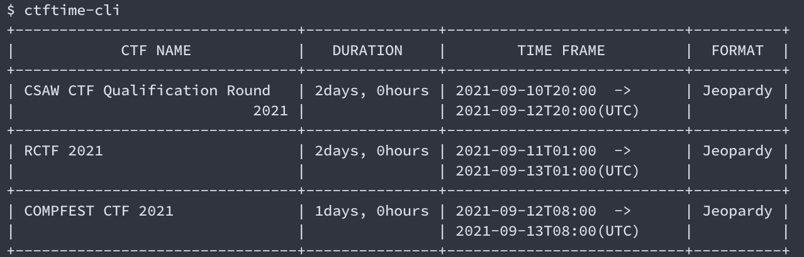

# CTFTIME CLI



# Installation
```
go get github.com/yu1hpa/ctftime-cli
```

# Usage
```
$ ctftime-cli -h

CTF TIME CLI Tool

AUTHOR:  yu1hpa

Usage:
  ctftime-cli [OPTIONS]

Examples:
  ctftime-cli -limit 5 -time 1422019499

Options:
  -limit int
        upper limit to display:[0-6] (default 3)
  -time int
        default time is UnixTime (default 1631186239)
  -type string
        type: [events] (default "events")
```

# AUTHOR
yu1hpa

# LICENSE
MIT
